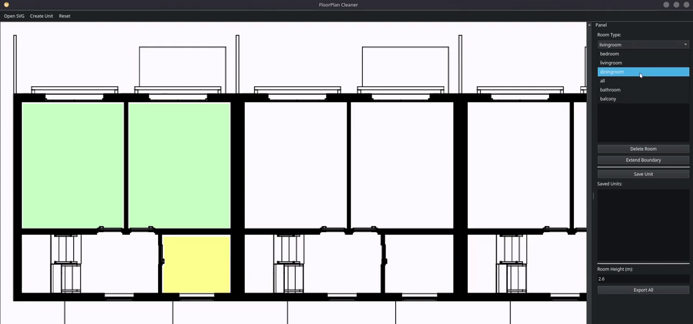

# FloorPlan Cleaner

A desktop preprocessing tool that converts IFC/BonsaiBIM-derived SVG floor plans—or floor plans drawn manually—into the Structured Scene Representation (SSR) consumed by the [Opening-Aware, Style-Coherent Apartment Furnishing](https://github.com/Thenolypus/master-thesis-ws25-26) pipeline.



## Features

- Detect enclosed rooms in IFC-annotated SVG floor plans.
- Assign room types and group rooms into apartment units.
- Preserve doors and windows in the exported SSR.
- Adjust detected room boundaries when the source drawing is ambiguous.
- Draw rooms and openings manually without an input SVG.
- Export room JSON files, unit metadata, and overview images for downstream furnishing.

## Requirements

- Python 3.10 or newer
- A desktop environment capable of running PySide6

## Quick start

```bash
git clone https://github.com/Thenolypus/FloorPlan-Cleaner.git
cd FloorPlan-Cleaner

python3 -m venv .venv
source .venv/bin/activate
python -m pip install -r requirements.txt
python main.py
```

The activation command above is for Bash and Zsh. Fish users should run:

```fish
source .venv/bin/activate.fish
```

## Clean an exported SVG

The SVG workflow is designed for 1:100 IFC/BonsaiBIM exports containing wall, door, and window metadata.

1. Select **Open SVG** and choose the exported floor plan.
2. Click inside each enclosed room to detect its boundary.
3. Select a room type and choose **Assign Label**.
4. Use **Extend Boundary** where a detected boundary needs correction.
5. After selecting all rooms belonging to an apartment, choose **Save Unit**.
6. Set the room height and choose **Export All**.

Repeat the room-selection and save steps before exporting when the SVG contains multiple apartment units.

## Draw a floor plan manually

Select **Create Unit** to draw a floor plan without an SVG:

1. Draw and close each room polygon.
2. Add doors and windows to the appropriate walls.
3. Assign a room type to every room.
4. Adjust opening widths where necessary.
5. Choose **Export Unit**.

Manual projects can be saved and reopened. Exported `metadata.json` files can also be loaded back into Create mode for editing.

## Export format

An SVG-based export produces:

```text
<selected-output>/<floorplan-name>/
├── metadata.json
├── <floorplan-name>_centered.svg
└── unit_1/
    ├── unit_1_overview.png
    ├── unit_1_overview.svg
    ├── unit_1_room_1_<type>.json
    └── unit_1_room_2_<type>.json
```

Each room JSON contains its boundary, room type, architectural openings, and an initially empty object list. `metadata.json` records the room-to-unit mapping and the transforms required to reconstruct the complete apartment.

Pass the exported floor-plan directory to the furnishing pipeline:

```bash
uv run python -m src.run.pipeline \
  --floorplan-dir /path/to/<floorplan-name> \
  --unit 1 \
  --checkpoint /path/to/checkpoint \
  --arch
```

## Roadmap

- Infer an editable initial sketch from PDF, JPEG, or PNG floor plans.

## License

Released under the [MIT License](LICENSE).
